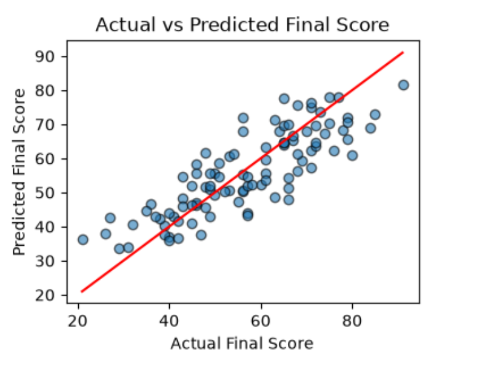
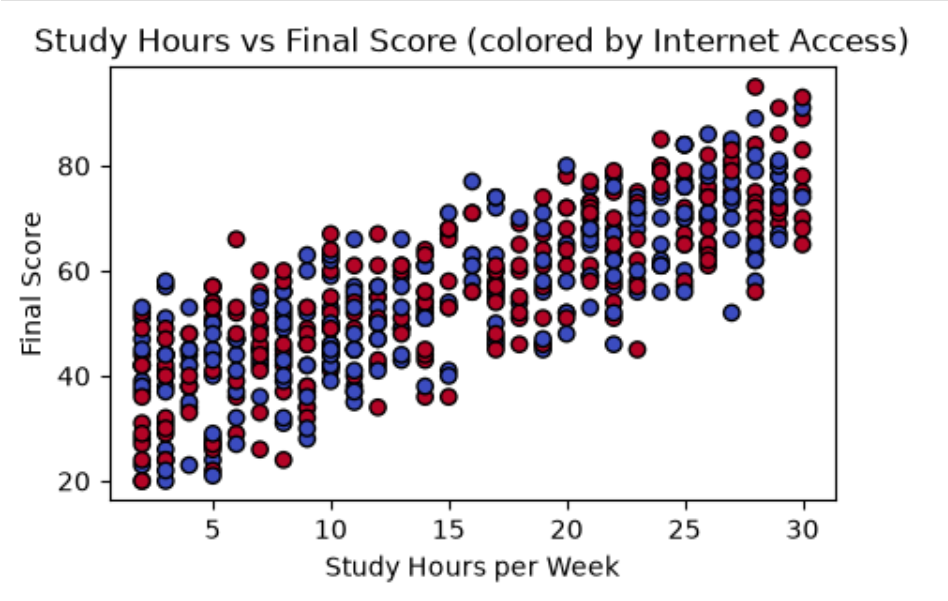
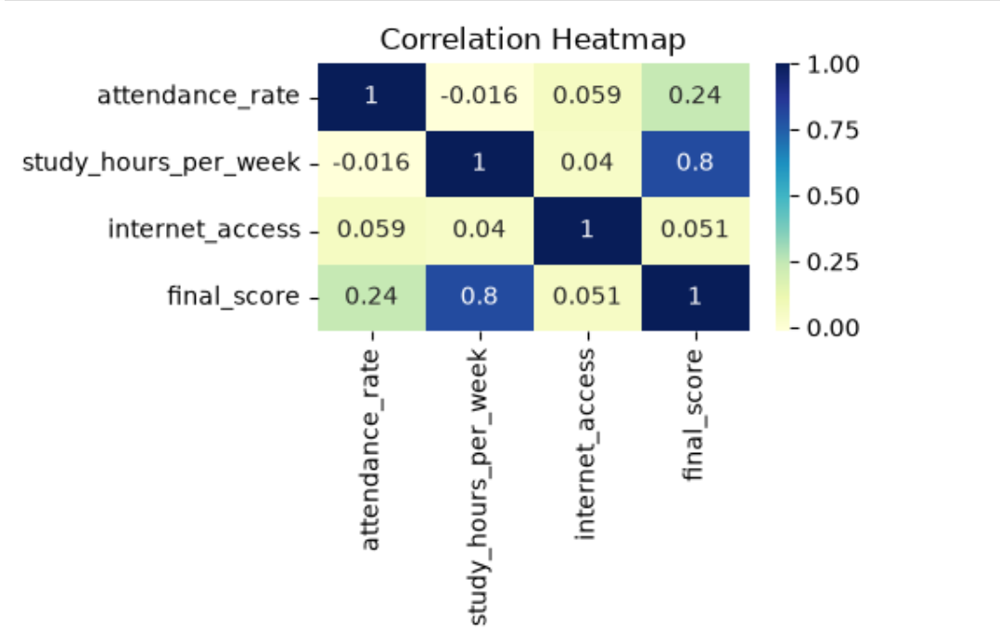

# Exam Score Prediction Using Linear Regression

A machine learning project that predicts a student's final exam score based on their **Attendance Rate**, **Study Hours per Week**, and **Internet Access**, using a Linear Regression model built with scikit-learn.

## 📌 Overview
This project uses a student performance dataset to train a regression model that estimates final exam scores. It covers the full ML workflow — data cleaning, feature selection, model training, evaluation, and visualization of prediction accuracy.

## 🛠️ Tech Stack
- Python
- pandas, NumPy
- scikit-learn
- Matplotlib, Seaborn

## 📊 Dataset
- **Features:** Attendance Rate, Study Hours per Week, Internet Access
- **Target:** Final Score (continuous numeric value)
- Source: Student Performance Dataset (Kaggle)

## ⚙️ Workflow
1. Data loading and inspection
2. Null value and duplicate checks
3. Feature encoding (Internet Access: Yes/No → 1/0)
4. Feature selection and train/test split
5. Model training (Linear Regression)
6. Prediction on new student input
7. Evaluation — R² Score
8. Visualization — Actual vs Predicted plot, correlation heatmap

## 📈 Results
- **R² Score:** 0.69254936209671

## 🖼️ Visualizations

### Actual vs Predicted Scores

*Comparison of actual final scores against model-predicted scores.*

### Study Hours vs Final Score

*Relationship between weekly study hours and final score, colored by internet access.*

### Correlation Heatmap

*Correlation between attendance rate, study hours, internet access, and final score.*

## 🚀 How to Run
1. Clone the repository
2. Install dependencies:
```bash
   pip install pandas numpy scikit-learn matplotlib seaborn
```
3. Open `Exam_Score_Prediction_Using_Linear_Regression.ipynb` in Jupyter Notebook and run all cells

## 👤 Author
Nazma Begum — [GitHub](https://github.com/Nijhumtara)
